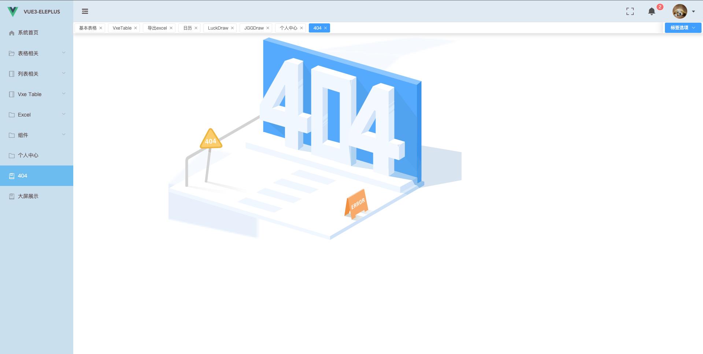

最近想使用 Vue3+vite+elementPlus等技术学习下Vue3，发现两个比较好的开源网站

vue-admin-system 和 vue3 vite template

基于这两个系统架构模式，开发出自己的一套项目，方便在以后的工作和学习中利用

技术栈： vue3 + elementPlus + vite + router + store + axios + mock 等技术

### 1、安装运行项目
***  
    git clone git@github.com:daySmile/vue3-vite-elementPlus-pro.git // 拉代码
    
    cd vue3-vite-elementPlus-pro  // 进入项目中

    npm install  // 安装依赖

    npm run dev  // 运行

项目部分截图：

## 有关mock的操作

### mock本地模拟数据和服务器请求数据进行切换

1、mock数据
在main.js中引入 mock.js文件就可以切换到mock环境
缺点： 不能再network下看到请求的接口
研究 mockServe技术可以弥补该缺点

2、和服务器对接口环境：
在vite中添加  server配置：
***
    server: {
        hmr: {overlay: false}, // 禁用或配置 HMR 连接 设置 server.hmr.overlay 为 false 可以禁用服务器错误遮罩层
        // 服务配置
        port: 3000,    // 类型： number 指定服务器端口;
        open: true,   // 类型： boolean | string在服务器启动时自动在浏览器中打开应用程序；
        cors: true,  // 类型： boolean | CorsOptions 为开发服务器配置 CORS。默认启用并允许任何源
        proxy: {    // 类型： Record<string, string | ProxyOp 为开发服务器配置自定义代理规则
            '/api-dri': {
                target: 'http://192.168.2.xxx:5000', // 服务器
                changeOrigin: true,
                secure: false,
                rewrite: (path) => path.replace('/api-dri', '/api-dri')
            }
        }
    },
